&nbsp;

---

## Featured Project

<table align="center">
<tr>
<td width="140" align="center" valign="middle">

</td>
<td valign="middle">

### [Rampage.lt](https://rampage.lt)

**Lithuanian Counter-Strike 2 community platform**

Full-stack platform powering **10 CS2 game servers** with a unified skin economy, player-to-player marketplace, ranked missions, clans, jewels currency, roulette, and real-time server monitoring. Built end-to-end — API, web frontend, in-game plugins, admin tooling, and deploy pipelines.

`.NET 10` · `Blazor Server` · `ASP.NET Core` · `MySQL` · `EF Core` · `SignalR` · `SwiftlyS2 / C#` · `Docker` · `Ansible`

**[Visit rampage.lt →](https://rampage.lt)**

</td>
</tr>
</table>

---

## GitHub Stats

---

## Repositories

**[Browse all repositories sorted by stars →](https://github.com/shmitzas?tab=repositories&sort=stars)**

<!--
Optional: pin specific repos below as cards. Replace REPO_NAME with the repo you want to feature.

-->

---

## Activity

---

## Tech Stack

